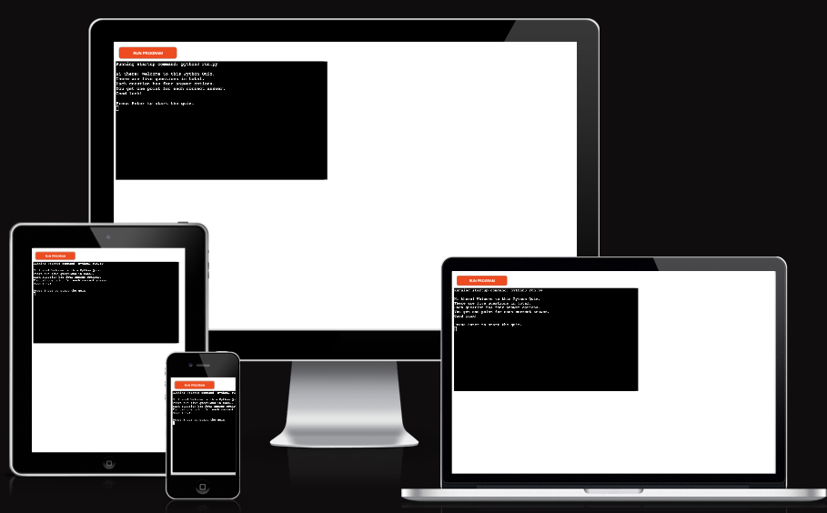

# Python Colors Quiz #

## Purpose of the project ##
The Python Colors Quiz is for anyone curious about unusual shades of regular colors that we all know and recognize. The quiz can be used for educational as well as recreational purposes. To introduce a competitive element, the quiz counts the player's score and displays the final score at the end.

The quiz game is responsive on mobile, computer and tablet size screens.



## How to play ##
The player begins by entering their name and receiving written instructions on how to play the quiz. Upon pressing Enter, the quiz commences.

The quiz contains multiple choice questions with four answer options per question. The player can choose one answer only, and receives one point for each correct answer. 

When the player submits an answer by typing 1-4 into the terminal, they can see if their choice was correct. If it was correct, they receive a confirmation and 1 point to their score. If their answer was incorrect, they do not receive any points and can see in print which choice was the correct answer. The player then needs to press Enter again to continue to the next question.

When all questions have been answered, the player is congratulated and informed of their final score.

## Features ##


__Introduction to game__
-	Welcomes the player and explains the rules.

__Display question and answer options__
-	Shows question and numerated answers.
-   Prompts user to input valid answer option.

__Input validation and checking error__
-	Player must enter a valid choice, a number between 1-4.
-   If any other characters are entered, the game asks the player to re-enter.

__Score incrementation__
-	If the submitted answer is correct, the score increments by 1.
-   If incorrect, the correct answer is displayed.
-   Press Enter to continue to the next question.

__End of game__
-	When all questions have been answered, the player's final score is displayed.


## Future features ##

- Both questions and answer options could be randomized to increase difficulty.
- A larger library of questions and answers could be added to create a quiz with variation.


## Technology ##
- [GitPod](https://gitpod.io/) was used to write, edit and commit the code, [GitHub](https://github.com/) was used for storage and version control.
- [PyCharm](https://www.jetbrains.com/pycharm/) was used to write and test the game in early development.
- [Heroku](https://www.heroku.com/) was used for deployment and testing.
- [Lucidchart](https://www.lucidchart.com/pages/) was used to create a flowchart of the project.
- [Am I Responsive](https://ui.dev/amiresponsive) was used to create screenshot of website on different screen sizes.


## Testing ##

### Code validation ###
- No errors were returned when passing the Python code through the [PEP8 Python Linter](https://pep8ci.herokuapp.com/)


### Manual testing ###
I have manually tested this project by doing the following:
- Run the code through pylint using the terminal and received a rating of 10/10.
- Entered invalid inputs as question answers (pressing Enter without any input, entering invalid numerals, entering letters and entering empty space) several times over.
- Used PEP8 Python validator and returned the code with no errors. Some comments regarding indentation were ignored as the validator did not recognize multi-line print statements.
- Tested the code in my local terminal as well as the Heroku terminal.

### Test cases ###

#### Quiz Introduction ####

- Testing performed: enter the URL of deployed page and click Run Program.

- Expected outcome: displays welcome message with instructions on how to play the quiz, and a prompt to press Enter to start.

- Result: as expected.

- Test passed.


#### Quiz Start ####

- Testing performed: press Enter after the introduction to start the quiz.

- Expected outcome: display first question along with 4 answer options. Display instruction on how to answer the question.

- Result: as expected.

- Test passed.


#### Enter valid answer option ####

- Testing performed: entering a valid number when answering a question (1-4).

- Expected outcome: See if my answer is correct, display the correct option, and my score.

- Result: as expected.

- Test passed.


#### Enter invalid answer option ####

- Testing performed: entering an invalid character (e.g. letter S) when answering a question.

- Expected outcome: alert message prompting me to re-enter a valid answer option.

- Result: as expected.

- Test passed.


#### End of quiz ####

- Testing performed: answer all questions.

- Expected outcome: display message showing final score.

- Result: as expected.

- Test passed.


### Fixed bugs ###

- In the early development of the game, I tried a number of different lists and dictionaries to store my questions and answers. The first one shown below has the question as the key and the answer options in a list as the value. This proved to be a rudimentary model as there was no sustainable way to index the questions.

```
QUESTIONS = {
    "Aureolin is a shade of what color?": [
        "Yellow", "Green", "Red", "Orange"
    ],
```
- This was followed by a more sophisticated model shown below. The model proved to be too complex for me to work with at this stage as there were numerous syntax errors in GitPod.

```
OptionItem: {
option_id: int,
optionText: ”string”, 
}

QuestionItem: {
question: ”string"
option: [OptionItem]
correctOption: int,
}

QuestionList: [QuestionItem]
```

## Deployment ##

### Via GitPod ###
The GitHub repository was created using the Code Institute Python Essentials template:
https://github.com/Code-Institute-Org/python-essentials-template
- Click the link to get to the template. Click “Use this template”.
- Enter repository name, make the repository public and click “Create repository from template”.
- Click the green GitPod button, wait a moment for the workspace to open. All work was committed in GitPod.

- The repository can be accessed through following link: https://github.com/robinozer/PythonProject.git

### Via Heroku ###
Heroku was used to deploy the website. The following steps were used:
- After creating an account, create a new app and navigate to the Settings tab.
- In Config Vars, click 'Reveal Config Vars' and add one with key 'PORT' and value '8000'.
- In Buildpacks, click 'Add buildpack' and select python, and then node.js, saving changes after each.

- Go to the Deploy tab, select GitHub as the Deployment Method, and confirm.
- Search for the repository name and connect.
- Deploy the branch.

## Credits ##
- CI for the deployment terminal.
